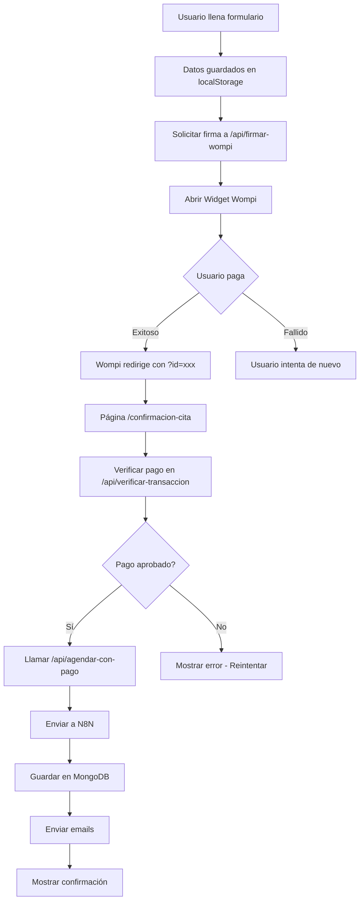

# Guía de Integración de Wompi - Sistema de Pagos para Citas

Esta guía detalla paso a paso cómo configurar el sistema de pagos con Wompi para el agendamiento de citas.

## 📋 Resumen del Flujo

### Flujo Anterior:
```
Usuario → Selecciona fecha/hora → Llena formulario → Confirma → N8N guarda en MongoDB
```

### Nuevo Flujo con Pago:
```
Usuario → Selecciona fecha/hora → Llena formulario → 
Pagar con Wompi → Pago exitoso → Verificación → N8N guarda en MongoDB
```

---

## 🔐 Paso 1: Obtener Credenciales de Wompi

### 1.1 Ingresar al Dashboard de Wompi
1. Ve a [https://comercios.wompi.co](https://comercios.wompi.co)
2. Inicia sesión con tu cuenta

### 1.2 Obtener las Llaves
1. En el menú lateral izquierdo, ve a **Desarrollo** → **Programadores**
2. Copia estas credenciales (las necesitarás más adelante):

#### Llave Pública
```
pub_prod_Nmluj5t0JTW6R27aezi121tlem0N41xt
```
- Se usa en el frontend (código visible)
- Permite abrir el widget de pago

#### Secreto de Integridad
```
(Ver en tu dashboard - botón "Mostrar")
```
- Se usa en el backend para generar firmas
- **NUNCA debe exponerse en el frontend**

#### Llave Privada  
```
(Ver en tu dashboard - botón "Mostrar")
```
- Se usa en el backend para verificar transacciones
- **NUNCA debe exponerse en el frontend**

---

## 🔧 Paso 2: Configurar Variables de Entorno

### 2.1 Archivo .env.local (Local)
Crea o edita el archivo `.env.local` en la raíz del proyecto:

```env
# Wompi - Credenciales de Producción
WOMPI_PUBLIC_KEY=pub_prod_Nmluj5t0JTW6R27aezi121tlem0N41xt
WOMPI_INTEGRITY_SECRET=tu_secreto_de_integridad_aqui
WOMPI_PRIVATE_KEY=prv_prod_xxxxxxxxxxxxx

# Precios de los servicios (en COP)
NEXT_PUBLIC_PRECIO_INDIVIDUAL=150000
NEXT_PUBLIC_PRECIO_PAREJAS=200000

# URL de redirección después del pago
NEXT_PUBLIC_REDIRECT_URL=http://localhost:3000/confirmacion-cita

# Webhooks existentes de N8N (mantener los actuales)
NEXT_PUBLIC_WEBHOOK_AGENDAR_CITAS=tu_webhook_n8n_actual
```

### 2.2 Variables en Vercel (Producción)
1. Ve a tu proyecto en [vercel.com](https://vercel.com)
2. Settings → Environment Variables
3. Agrega cada variable:

| Nombre | Valor | Environments |
|--------|-------|--------------|
| `WOMPI_PUBLIC_KEY` | `pub_prod_...` | Production, Preview |
| `WOMPI_INTEGRITY_SECRET` | `(tu secreto)` | Production, Preview |
| `WOMPI_PRIVATE_KEY` | `prv_prod_...` | Production, Preview |
| `NEXT_PUBLIC_PRECIO_INDIVIDUAL` | `150000` | Production, Preview |
| `NEXT_PUBLIC_PRECIO_PAREJAS` | `200000` | Production, Preview |
| `NEXT_PUBLIC_REDIRECT_URL` | `https://sandravargaspsicologa.com/confirmacion-cita` | Production |
| `NEXT_PUBLIC_REDIRECT_URL` | `https://tu-preview.vercel.app/confirmacion-cita` | Preview |

**Importante**: Las variables que empiezan con `NEXT_PUBLIC_` son visibles en el frontend.

---

## 🔗 Paso 3: Configurar Link de Redirección en Wompi

Ahora que sabemos la URL de redirección, debemos configurarla en Wompi:

### 3.1 Crear Links de Pago Personalizados (Opcional)

Si quieres usar Links de Pago:

1. Ve a **Recibir pagos** → **Link pago personalizado**
2. Crea dos links:

#### Link para Terapia Individual
- **Nombre del producto**: Terapia Individual - Sandra Vargas
- **Precio**: $150,000 COP
- **Link de redirección**: `https://sandravargaspsicologa.com/confirmacion-cita`
- **SKU**: `TERAPIA-INDIVIDUAL`

#### Link para Terapia de Parejas
- **Nombre del producto**: Terapia de Parejas - Sandra Vargas
- **Precio**: $200,000 COP
- **Link de redirección**: `https://sandravargaspsicologa.com/confirmacion-cita`
- **SKU**: `TERAPIA-PAREJAS`

**Nota**: En nuestra implementación usaremos el Widget de Wompi directamente en el sitio, por lo que los links personalizados son opcionales.

---

## 📁 Paso 4: Archivos Creados

Los siguientes archivos se han creado automáticamente:

### API Routes (Backend)
- `pages/api/firmar-wompi.ts` - Genera firmas de seguridad
- `pages/api/verificar-transaccion.ts` - Verifica estado del pago
- `pages/api/agendar-con-pago.ts` - Agenda cita después de verificar pago

### Páginas
- `pages/confirmacion-cita.tsx` - Página de redirección post-pago
- `pages/_document.tsx` - Incluye script de Wompi Widget

### Componentes Modificados
- `components/AppointmentScheduler.tsx` - Integrado con flujo de pago

### Archivos de Configuración
- `.env.local.example` - Plantilla de variables de entorno

---

## 🧪 Paso 5: Probar la Integración

### 5.1 Pruebas Locales
```bash
# 1. Instala dependencias
npm install

# 2. Configura .env.local con tus credenciales

# 3. Inicia el servidor de desarrollo
npm run dev

# 4. Ve a http://localhost:3000
```

### 5.2 Flujo de Prueba
1. Selecciona un servicio (Individual o Parejas)
2. Elige modalidad (Presencial o Virtual)
3. Selecciona fecha y hora
4. Llena el formulario
5. Haz clic en "Pagar y Confirmar Cita"
6. Se abrirá el widget de Wompi
7. Completa el pago
8. Serás redirigido a la página de confirmación
9. La cita se guardará automáticamente en MongoDB vía N8N

### 5.3 Tarjetas de Prueba de Wompi

Para pruebas, usa estas tarjetas:

**Aprobada**:
- Número: `4242 4242 4242 4242`
- CVV: `123`
- Fecha: Cualquier fecha futura
- Cuotas: `1`

**Rechazada**:
- Número: `4111 1111 1111 1111`
- CVV: `123`
- Fecha: Cualquier fecha futura

---

## 🔍 Paso 6: Verificar que Todo Funciona

### 6.1 Checklist de Verificación

- [ ] El widget de Wompi se abre correctamente
- [ ] Los precios son correctos (Individual: $150,000 | Parejas: $200,000)
- [ ] El nombre y email del usuario se pre-llenan en Wompi
- [ ] Después del pago exitoso, redirige a `/confirmacion-cita`
- [ ] La página de confirmación verifica el pago
- [ ] Si el pago es aprobado, se agenda la cita
- [ ] Se guarda el slot en MongoDB (no disponible para otros)
- [ ] Se envían los emails de confirmación vía N8N

### 6.2 Logs a Revisar

Abre la consola del navegador (F12) y verifica:
```
✓ Firma generada correctamente
✓ Widget de Wompi abierto
✓ Transacción ID: txn_xxxxx
✓ Estado del pago: APPROVED
✓ Cita agendada en MongoDB
```

---

## 🚨 Solución de Problemas

### Error: "Widget no se abre"
**Causa**: Script de Wompi no cargado
**Solución**: Verifica que `_document.tsx` incluya el script

### Error: "Firma inválida"
**Causa**: `WOMPI_INTEGRITY_SECRET` incorrecto
**Solución**: Verifica que coincida con el dashboard de Wompi

### Error: "Pago aprobado pero cita no se agenda"
**Causa**: Falla en verificación o webhook N8N
**Solución**: 
1. Verifica logs en `/api/agendar-con-pago`
2. Verifica que el webhook de N8N esté funcionando

### Error: "Slot ya ocupado después de pagar"
**Causa**: Otra persona reservó el mismo horario
**Solución**: El sistema debe liberar el slot temporalmente durante 10 minutos al iniciar el pago

---

## 📊 Flujo Técnico Detallado



---

## 🔐 Seguridad

### Buenas Prácticas Implementadas

1. **Nunca exponer claves privadas**: Solo se usan en el servidor
2. **Verificación en backend**: Siempre verificar el pago en el servidor
3. **Firmas SHA256**: Evitar manipulación de precios
4. **HTTPS obligatorio**: Wompi requiere HTTPS en producción
5. **Reservas temporales**: Slots bloqueados por 10 minutos durante pago

---

## 📱 Paso 7: Desplegar a Producción

### 7.1 Commit y Push
```bash
git add .
git commit -m "Integrar sistema de pagos Wompi para agendamiento de citas"
git push origin main
```

### 7.2 Vercel Deploy
Vercel detectará el push automáticamente y desplegará.

### 7.3 Verificar Variables
1. Ve a Vercel → Settings → Environment Variables
2. Asegúrate de que todas las variables estén configuradas
3. Redeploy si es necesario

---

## 📞 Soporte

Si encuentras problemas:

1. **Documentación Wompi**: [https://docs.wompi.co](https://docs.wompi.co)
2. **Soporte Wompi**: Desde tu dashboard de comercios
3. **Logs de Vercel**: Vercel → Logs para ver errores en producción

---

## ✅ Checklist Final

- [ ] Credenciales de Wompi obtenidas
- [ ] Variables de entorno configuradas (local y Vercel)
- [ ] Script de Wompi cargado en el sitio
- [ ] Flujo de pago probado localmente
- [ ] Webhooks de N8N funcionando
- [ ] Guardado en MongoDB verificado
- [ ] Emails de confirmación enviándose
- [ ] Desplegado a producción
- [ ] Prueba end-to-end en producción exitosa

---

## 🎉 ¡Listo!

Tu sistema de agendamiento con pago previo está completamente configurado y funcional.

**Última actualización**: 2026-01-16
